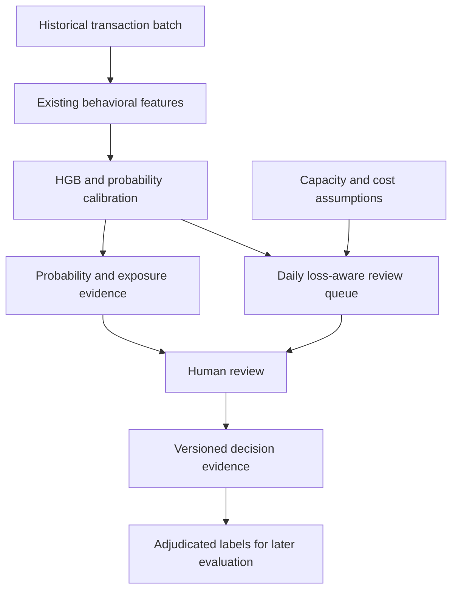

# CommerceGuard: financial-loss-aware human review

The product focus is one operational question: **Which transactions should an enterprise investigate when its analysts can review only a fixed number each day?**

This extends the existing CommerceGuard demo with an independently trained ML queue benchmark and a persistent web review workflow. It is a shadow-mode prototype, not a production deployment or a claim to beat commercial fraud platforms.

## Product boundary and differentiation

The original MerchantShield estimates transaction fraud risk and explains it. The existing CommerceGuard extension adds spending mandates, human approval, replay protection and evidence receipts. The new work compares risk-only ranking with financial-loss-aware ranking under exactly the same review capacity. Existing authorization controls remain deterministic; an ML score cannot override an expired or revoked mandate.

The intended enterprise value is making review capacity explicit and making the resulting financial tradeoff reproducible. Behavioral scoring, SHAP, case management and prioritization already exist in the market. Feedzai describes alert prioritization and case management at https://www.feedzai.com/riskops/ and https://www.feedzai.com/solutions/aml-transaction-monitoring/ . Featurespace describes behavioral fraud scoring and reducing false positives at https://www.featurespace.com/solutions/payment-fraud . These capabilities are not unique inventions of this project. There are no vendor models, matched vendor datasets or vendor performance measurements in this package.

The defensible differentiation for this student project is an inspectable capacity contract, a calibrated loss-ranking policy, and a benchmark showing both financial benefit and analyst friction. Global novelty and enterprise adoption remain unproven.

## Focused execution architecture

The complete package implements intake, scoring, the daily queue, human review and evidence receipts. The `/reviews` dashboard calls protected FastAPI endpoints and shares CommerceGuard's SQLite evidence store. Reviewer dispositions are recorded with explicitly unverified provenance. L remains a future adjudication workflow; reviewer approvals must not automatically become fraud labels.

Reuse the existing FastAPI backend and React dashboard for that integration. For the previously agreed enterprise architecture, retain Azure Front Door, Spring Boot, FastAPI, RabbitMQ and Azure Service Bus. Their responsibilities should remain within this one review workflow: Front Door routes requests; Spring Boot owns enterprise identity, tenant access and review orchestration; FastAPI owns ML scoring; RabbitMQ carries internal scoring jobs; Service Bus carries external business events. Use one persisted case store with tenant-aware access. This is a target design; those enterprise components are not implemented or validated by this ML package.

The solo build does not require deploying those components simultaneously. First demonstrate the batch core; next connect it to the working demo; then replace prototype identity and persistence with the enterprise boundary. The batch sort is O(n log n), and capacity limits analyst workload rather than inference throughput. No throughput, latency SLA, multi-tenant isolation or enterprise-scale claim has been measured yet.

## The ML pipeline

1. Validate transaction amounts, identifiers, probabilities and UTC timestamps. Use one currency per batch; convert currencies upstream if needed.
2. Reuse the existing 15 behavioral features: amount, deviation from prior spend, velocity, prior failures, device and geography novelty, account age and time features. Fraud labels are excluded from the model input.
3. Train HistGradientBoosting on days 0–34. Search exactly four predeclared combinations: 15 or 31 leaves and 180 or 300 boosting iterations. This uses existing scikit-learn, with no new ML dependency.
4. Fit sigmoid calibration on days 35–39. Calibration aligns the probability scale with the observed synthetic fraud frequency; it is not a guarantee of accuracy under a new real-world distribution.
5. Select the candidate with the lowest assumed review error cost on days 40–49 at 50 reviews per UTC day. Calibration and selection do not use the later evaluation data.
6. Freeze the artifact, policy and review capacity. Report days 50–59 of the original stream as development evidence because that period was examined earlier in this project.
7. Evaluate the frozen artifact on the final ten days of three newly generated streams with seeds 20261007, 20261008 and 20261009. Each stream has its own prior history for feature construction. None of these streams is used for training or calibration.

The selected model has 31 leaves and 300 iterations. The API's existing LightGBM artifact has not been replaced; the new HGB artifact is for the batch queue.

## Review allocation

Let p be calibrated fraud probability, A transaction amount, L the assumed unrecoverable fraction and F the assumed false-alert cost:

`priority = p × A × L − (1 − p) × F`

With equal case review time, sorting by this expected net benefit maximizes the modeled benefit within a fixed daily case count. The reference policy ranks the very same probabilities by p alone. The benchmark fills the same number of slots for both policies. Negative-benefit selections are explicitly flagged; an operational policy could leave those slots empty, but that would be a different experiment.

The current assumptions reuse the project's cost model: L = 0.5 and F = ₹50. They are configurable assumptions, not merchant-measured costs. A ₹50 false alert and a missed ₹20,000 fraud do not have equivalent modeled impact. This queue deliberately values money rather than maximizing fraud count or precision.

No generative LLM is needed for ranking. Explanations should present the probability, amount, cost assumptions, rank and capacity. Existing SHAP explanations describe the model; they do not prove causation or change authorization policy. A high amount with low probability can legitimately rank ahead of a small high-probability transaction, and reviewers must see that reason.

## Measured results

The three fresh streams contain 106,705 evaluation transactions and 1,342 labeled frauds. The benchmark uses 50 reviews a day, ten evaluation days per stream.

| Metric, pooled fresh synthetic evaluation | Risk ranking | Loss ranking |
|---|---:|---:|
| Reviews | 1,500 | 1,500 |
| Fraud transactions identified | 1,055 | 919 |
| False alerts | 445 | 581 |
| Review precision | 70.33% | 61.27% |
| Labeled fraud value selected | ₹4,721,734.92 | ₹4,911,287.21 |
| Assumed error cost | ₹261,229.17 | ₹173,253.03 |

Loss ranking identifies **4.01% more labeled fraud value** and reduces **assumed error cost by 33.68%**. It catches fewer fraud transactions and sends more legitimate transactions to review. These are synthetic, descriptive results; they are not observed prevented losses, realized savings or commercial-vendor comparisons. The cost reduction depends on the stated assumptions.

The proposed 200% improvement would mean 3× the baseline value identified at the same capacity. That target was not reached. Do not put a 3× or 200% performance claim in the presentation.

## What the solo developer should complete next

1. **Completed: integrate the queue.** Batch import, reviewer list, case details and receipt export are available at `/reviews`. Each case records transaction ID, model hash, probability, amount, capacity, rank, policy version and feature context. HGB context explanations are descriptive; the separate LightGBM screen continues to show SHAP attribution.
2. **Completed: persist stable case identity.** Canonical dataset, policy and model hashes define idempotent imports. SQLite serializes mutations. Review days are frozen to one batch, completed cases remain closed, and overlapping new batches are rejected. Enterprise reviewer assignment and incremental streaming remain future work. Repeated customer transactions use separate slots; grouping requires its own leakage-safe evaluation.
3. **Measure on the intended domain.** Use licensed, adjudicated transaction data or an anonymized enterprise pilot. These synthetic payment transactions do not establish procurement-invoice fraud performance. Existing external-validation limitations still apply. Keep issuer, merchant, tenant and time holdouts where possible and account for delayed fraud labels.
4. **Run cost and capacity experiments prospectively.** Set merchant costs and review budgets before opening a new holdout. Measure value recall, precision, count recall, reviewer minutes, backlog and slice performance. Compare against an actual incumbent or documented baseline on identical inputs. If review durations vary, the current top-K formulation is insufficient.
5. **Add deployment controls before enterprise use.** Tenant authorization, durable persistence, trusted artifact loading, immutable external anchoring for evidence, load testing and fail-safe behavior under missing models are prerequisites. A local hash chain alone is not independent evidence of authenticity.

## Validation and evidence

18 queue tests verify daily capacity, monetary ranking, deterministic ties, no label influence, empty queues and malformed input rejection. Web integration tests additionally cover idempotent imports, concurrent reviews, restart persistence, history cutoffs, access control, pagination and evidence tampering. `benchmark.json` includes all four candidates, all three fresh results, software versions, source-data and artifact hashes. Each `queue_*.csv` includes every scored transaction, its rank and selection status. See `VERIFICATION.md` for the final check results.

The inherited feature builder processes customer histories in order. The web importer rejects identical customer timestamps, duplicate IDs and engineered-feature columns; uploaded histories remain operator-supplied and unverified. The demo's raw inputs are synthetic. The generator uses random UUIDs in addition to its numeric seed, so re-running the seed does not reproduce the raw byte hash exactly. This package includes the exact raw development and fresh snapshots used for this benchmark, so the hashes can be verified.

## Presentation wording

“CommerceGuard optimizes a fixed human-review budget for financial exposure. We trained and calibrated an HGB model, froze the policy, and tested three fresh synthetic streams. Compared with ranking the same model by fraud probability, loss-based ranking identified 4.01% more fraud value and lowered assumed error cost by 33.68%, with a disclosed increase in false alerts. Real enterprise validation is the next step.”
